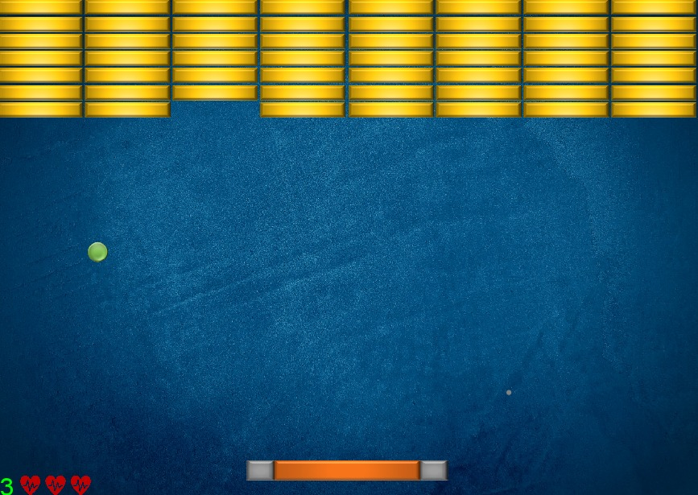
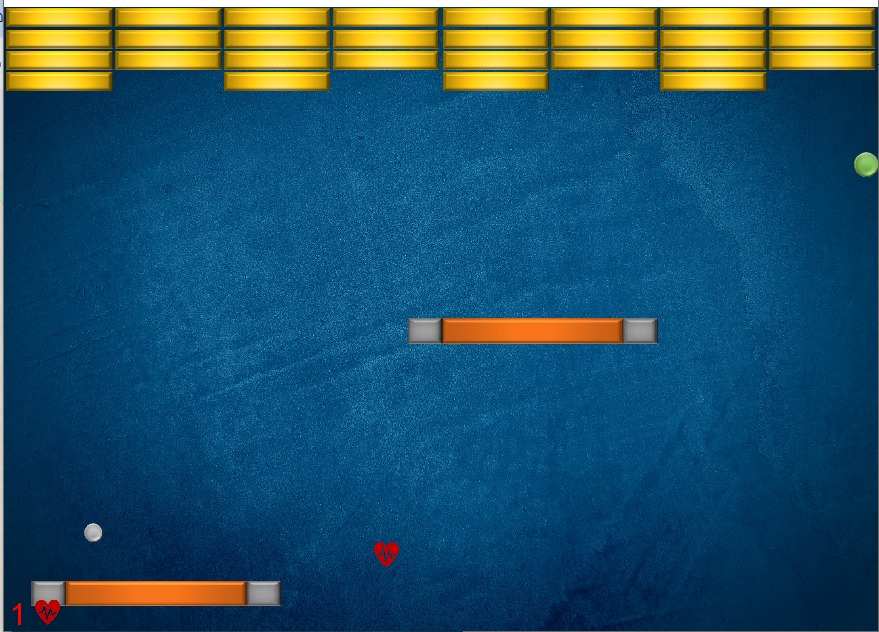

# Bricker-Game

Bricker is a 2D platformer game developed in Java, following OOP principles, with DanoGameLab library.

## Media

## Usage

- Use the arrow keys for movement.

## Contributing

Contributions are welcome! Feel free to submit bug reports, feature requests, or pull requests to help improve Pepse.

## License

This project is licensed under the MIT License - see the [LICENSE](https://choosealicense.com/licenses/mit/) file for details.
